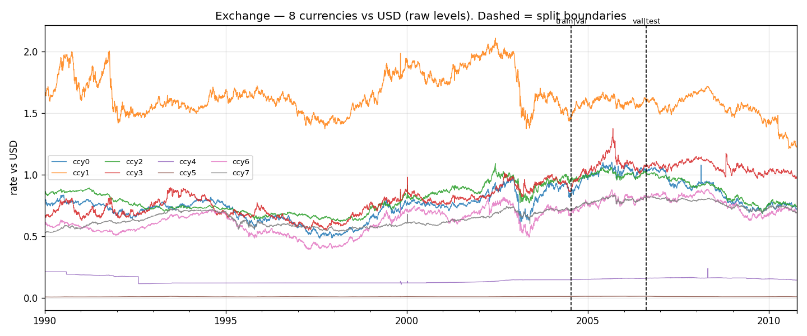
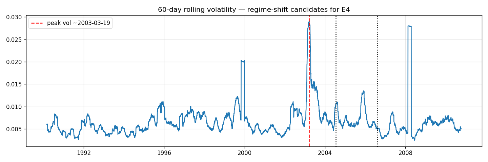
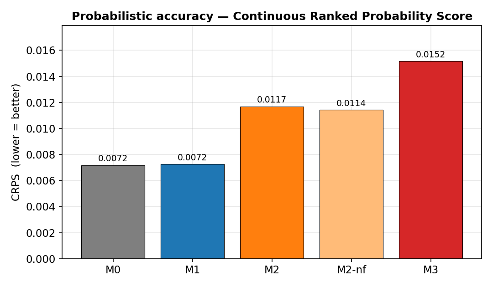

<!-- ============================================================ -->
<!-- Documento interno di studio. Generato in Markdown; il PDF A4 -->
<!-- si ottiene con pandoc (vedi Appendice B). Le figure sono in   -->
<!-- ../figures/cmp_*.png, prodotte da experiments/plot_results.py -->
<!-- a partire da results/registry.csv: nessun numero è scritto a  -->
<!-- mano.                                                          -->
<!-- ============================================================ -->

# Sintesi esecutiva

Questo documento è il **rendiconto interno** della parte di progetto che abbiamo chiamato *sandbox*: l'ambiente di lavoro piccolo e veloce sul dataset **Exchange** (tassi di cambio giornalieri) in cui abbiamo costruito, fatto funzionare e confrontato — *dal modello più semplice al più sofisticato* — una **scala di quattro modelli** di previsione (*forecasting*) di serie temporali, da un baseline banale fino a un **modello di diffusione condizionato**. Lo scopo della *sandbox* non è produrre il risultato scientifico finale del progetto (che vivrà sul dataset primario, energetico), ma **portare l'intera *pipeline* "in verde"** — cioè farla girare end-to-end, in modo riproducibile e onesto — *prima* di pagare il costo computazionale del dataset grande.

Il documento è scritto per essere **letto e studiato** da tutti i membri del gruppo. Diamo per acquisite le basi di **statistica, *data science*, *machine learning* (ML) e probabilità**; non diamo invece per acquisite né le **serie temporali**, né le **serie temporali multivariate**, né i modelli specifici che useremo (DeepAR, TimeGrad). Per questo ogni concetto viene introdotto da zero, ogni sigla viene sciolta per esteso alla prima occorrenza, e la parte matematica (in particolare il modello di diffusione) è derivata per intero.

**La scala dei modelli.** Useremo per tutto il documento un codice mnemonico stabile:

| Codice | Modello | Famiglia | Natura |
|---|---|---|---|
| **M0** | *seasonal-naive* (persistenza) | baseline | non addestrato |
| **M1** | ARIMA | statistico classico | lineare-gaussiano |
| **M2** | DeepAR | *deep learning* autoregressivo | rete neurale + testa parametrica |
| **M2-nf** | DeepAR *no time-features* | ablazione di M2 | come M2 senza covariate di calendario |
| **M3** | TimeGrad | *deep learning* generativo | RNN condizionante + **diffusione** |

**Il risultato in una frase.** Sulla serie Exchange — che l'analisi esplorativa mostra essere quasi un **random walk** puro — **nessun modello batte la persistenza**: né il modello statistico, né le reti neurali, né la diffusione. Anzi, salendo la scala di complessità il costo computazionale esplode (TimeGrad costa circa **25×** in inferenza rispetto al *deep* baseline e oltre **1000×** rispetto al baseline banale) mentre la qualità probabilistica **peggiora**. Questo non è un fallimento dell'esperimento: è esattamente la tesi del progetto sul rapporto **qualità  $\leftrightarrow$  costo** ("*no free lunch*"), osservata in laboratorio nel caso-limite in cui i dati non contengono la struttura che i modelli sofisticati sanno sfruttare. La *sandbox* serve proprio a stabilire questo ancoraggio di onestà prima di passare a un dataset (l'energia) dove ci aspettiamo che la struttura — stagionalità forte, regimi — premi i modelli più espressivi.

I numeri esatti, le tabelle e i sei grafici di confronto sono nella **Sezione 9 (Risultati)**; la loro lettura ragionata — la parte più importante del documento — è nella **Sezione 10 (Interpretazione)**.

---

# 1. Scopo e contesto

## 1.1 Il progetto e questa *sandbox*

Il progetto d'esame chiede di studiare la **previsione probabilistica di serie temporali tramite modelli di diffusione**, confrontandoli in modo rigoroso con metodi classici e con il *deep learning* "standard" lungo tre assi: **accuratezza**, **costo** e **calibrazione** dell'incertezza. Il deliverable scientifico finale verrà prodotto sul **dataset primario** (dominio energetico, con un *pillar* economico/applicativo). Questo rendiconto, però, riguarda esclusivamente la ***sandbox***: un ambiente separato, su un dataset diverso e più piccolo (**Exchange**, tassi di cambio), il cui unico obiettivo è **costruire e validare la *pipeline***.

La distinzione è importante e va tenuta a mente per tutta la lettura:

- **Ambito di questo documento**: dataset Exchange; quattro modelli M0–M3 (più l'ablazione M2-nf); nessun *pillar* economico; nessuna pretesa di generalità scientifica.
- **Fuori ambito** (non trattato qui): il dataset energetico primario, l'analisi economica, e qualunque conclusione "definitiva" sul valore della diffusione. La *sandbox* prepara il terreno; non lo conclude.

## 1.2 Perché una *sandbox*, e perché Exchange

Addestrare e valutare modelli generativi su serie temporali è costoso e fragile: il *tooling* (le librerie) ha forti vincoli di versione, l'addestramento richiede GPU (*Graphics Processing Unit*, l'acceleratore hardware tipico del *deep learning*), e i bug si manifestano spesso solo a fine *run*, dopo aver consumato tempo macchina. Affrontare tutto questo **per la prima volta** direttamente sul dataset grande significherebbe pagare il costo pieno a ogni tentativo fallito.

La strategia adottata è invece quella del **"get-it-green-first"**: portare l'intera catena — caricamento dati, scaling, finestre, addestramento, campionamento, metriche, registro dei risultati — a funzionare end-to-end su un dataset **piccolo e veloce**, e solo dopo scalare. Exchange è la scelta naturale per questo ruolo:

- è **piccolo** (circa 7 600 passi temporali, 8 serie) e quindi gira in minuti, non ore;
- è un **benchmark standard** della letteratura *multivariate forecasting* (proviene dal *benchmark* LSTNet, *Long- and Short-term Time-series Network*) ed è **la stessa lineage di dati usata nell'articolo originale di TimeGrad** — quindi il nostro M3 lavora su dati per cui quel modello è stato pensato;
- ha una struttura statistica (la vedremo: quasi-random-walk, niente stagionalità di calendario) **deliberatamente diversa** da quella del dataset energetico (stagionalità fortissima). Usare due dataset con strutture opposte ci impedisce di **sovra-adattare le conclusioni** a un solo tipo di segnale.

In altre parole: Exchange non è scelto perché ci aspettiamo che la diffusione vi brilli — anzi, vedremo che è un caso *avverso* per i modelli espressivi — ma perché è il banco di prova ideale per **verificare la correttezza della *pipeline*** e per **calibrare le nostre aspettative** con un caso onesto e difficile.

## 1.3 Cosa significa "in verde"

Diciamo che la *sandbox* è "in verde" quando **tutti e quattro** i modelli:

1. si addestrano (quando previsto) e producono previsioni **senza errori** end-to-end;
2. vengono valutati con **esattamente lo stesso** modulo di metriche e **lo stesso protocollo** (stesso split, stesse finestre, stessa scala dei dati), così che i numeri siano **confrontabili**;
3. scrivono una **riga ciascuno** in un registro unico dei risultati (`results/registry.csv`), da cui ogni tabella e ogni figura di questo documento è generata automaticamente.

Al momento della stesura, questo obiettivo è **raggiunto**: il registro contiene le cinque righe (M0, M1, M2, M2-nf, M3) e la scala è completa.

---

# 2. Il problema e la domanda di ricerca

## 2.1 Il problema, in termini formali

Osserviamo una serie temporale **multivariata**: a ogni istante $t$ misuriamo un vettore di $D$ numeri reali,
$$
\mathbf{x}_t \in \mathbb{R}^{D}, \qquad t = 1, 2, \dots, T,
$$
dove nel caso Exchange $D = 8$ (otto tassi di cambio rispetto al dollaro USA) e $T \approx 7\,600$ giorni. Le $D$ componenti si chiamano **canali** (*channels*).

Il compito di **previsione** (*forecasting*) è: dato un **contesto** delle ultime $H$ osservazioni (*context length*, anche detto *lookback window*), prevedere le successive $\tau$ (l'**orizzonte**, *horizon* o *prediction length*):
$$
\underbrace{\mathbf{x}_{t-H+1}, \dots, \mathbf{x}_{t}}_{\text{contesto, } H \text{ passi}} \;\longrightarrow\; \underbrace{\mathbf{x}_{t+1}, \dots, \mathbf{x}_{t+\tau}}_{\text{da prevedere, } \tau \text{ passi}} .
$$
Nei nostri esperimenti $H = 60$ e $\tau = 30$ (circa un trimestre di contesto per prevedere sei settimane lavorative).

La differenza cruciale di questo progetto rispetto al *forecasting* "puntuale" classico è che **non vogliamo un solo numero per ciascun istante futuro**, ma un'intera **distribuzione di probabilità**:
$$
p\big(\mathbf{x}_{t+1:t+\tau} \,\big|\, \mathbf{x}_{t-H+1:t}\big),
$$
cioè il **forecasting probabilistico**. La ragione è che nelle applicazioni reali (gestione del rischio, dimensionamento di riserve energetiche, *trading*) ciò che conta non è solo "quanto" ma "**quanto siamo sicuri**": serve sapere l'incertezza, e serve che quell'incertezza sia **calibrata** (né troppo ottimista né troppo pessimista). Approfondiamo la distinzione puntuale/probabilistico nella Sezione 3.

## 2.2 La domanda di ricerca della *sandbox*

La domanda scientifica generale del progetto ("**i modelli di diffusione offrono un vantaggio probabilistico che ne giustifichi il costo?**") sarà affrontata sul dataset primario. La domanda **specifica della *sandbox*** è più circoscritta e strumentale, ma altrettanto precisa:

> *Su una serie temporale multivariata reale ma "difficile" come Exchange, salendo una scala di modelli di complessità crescente — dal baseline banale alla diffusione condizionata — come si muovono insieme **accuratezza puntuale**, **qualità probabilistica**, **calibrazione** e **costo computazionale**? E la pipeline è corretta, riproducibile e priva di* data leakage*?*

Questa formulazione contiene già le tre cose che misureremo per ogni modello:

- **accuratezza puntuale** — quanto la previsione "centrale" si avvicina alla verità (metriche MAE, RMSE, MASE; Sezione 5.6);
- **qualità e calibrazione probabilistica** — quanto la *distribuzione* prevista è insieme corretta e *affilata* (metriche CRPS, *coverage*, *width*, *pinball*);
- **costo** — tempo di addestramento (*fit*) e di inferenza (*predict*), e implicitamente l'hardware necessario.

## 2.3 L'ipotesi di lavoro (e perché ci aspettiamo che fallisca, qui)

La nostra ipotesi, **prima** di guardare i risultati, è la seguente. L'analisi esplorativa (Sezione 4) mostrerà che i livelli di Exchange si comportano quasi come un **random walk** ("passeggiata aleatoria": il valore di domani è quello di oggi più un disturbo imprevedibile). Per un random walk **puro**, la teoria dice che:

- la **migliore previsione puntuale** è semplicemente *l'ultimo valore osservato* (la persistenza, cioè il nostro M0);
- la **migliore distribuzione predittiva** è l'ultimo valore più l'accumulo dei disturbi futuri.

Se i dati sono *davvero* (quasi) un random walk, allora **non c'è struttura nella media condizionata** da imparare, e modelli più espressivi non possono fare meglio del baseline sul piano puntuale; possono solo sperare di **modellare meglio l'incertezza** (la forma della distribuzione: code pesanti, *volatility clustering*). La *sandbox* serve quindi anche a verificare un'**affermazione di onestà**: se affermassimo un vantaggio della diffusione *anche* dove i dati non lo permettono, sapremmo che c'è un bug o un *leakage*. Ci aspettiamo, e vedremo confermato, che **battere M0 vada *guadagnato*** — e che su Exchange non venga guadagnato da nessuno.

---

# 3. Fondamenti (per chi viene dal ML "tabulare")

Questa sezione costruisce il vocabolario minimo per leggere il resto. Chi ha già dimestichezza con le serie temporali può passare alla Sezione 4, ma consigliamo almeno una lettura veloce di §3.3 (random walk) e §3.5 (puntuale vs probabilistico), perché su quei due concetti poggia tutta l'interpretazione finale.

## 3.1 Cos'è una serie temporale (e perché non è ML tabulare)

Nel ML "tabulare" che conosciamo, i dati sono un insieme di esempi **indipendenti e identicamente distribuiti** (*i.i.d.*): l'ordine delle righe non conta, e mescolarle (*shuffle*) prima di dividere in *train/test* è non solo lecito ma raccomandato. Una **serie temporale** rompe entrambe le ipotesi:

- **l'ordine è informazione**: $\mathbf{x}_t$ dipende dal suo passato $\mathbf{x}_{t-1}, \mathbf{x}_{t-2}, \dots$. Le osservazioni sono **autocorrelate**, non indipendenti;
- **non si può mescolare**: mischiare gli istanti distruggerebbe proprio la struttura che vogliamo modellare, e — peggio — userebbe il futuro per prevedere il passato (*data leakage* temporale).

Formalmente una serie temporale è la realizzazione di un **processo stocastico** $\{\mathbf{x}_t\}_{t \in \mathbb{Z}}$, cioè una famiglia di variabili aleatorie indicizzate dal tempo. "Modellare la serie" significa stimare proprietà della legge congiunta di queste variabili — in particolare la legge **condizionata** del futuro dato il passato, che è esattamente l'oggetto $p(\mathbf{x}_{t+1:t+\tau}\mid \mathbf{x}_{1:t})$ del §2.1.

## 3.2 Univariata vs multivariata

Una serie è **univariata** se a ogni istante misura *un* numero ($D=1$): per esempio il consumo elettrico totale di un edificio. È **multivariata** se ne misura $D>1$ insieme: nel nostro caso $D=8$ tassi di cambio osservati lo stesso giorno.

La multivariata aggiunge una dimensione di difficoltà che il gruppo deve tenere a mente perché è **il punto in cui i modelli si differenziano di più**: oltre alla dipendenza *temporale* (un canale con il proprio passato) esiste la dipendenza **fra canali** allo stesso istante (*cross-channel*, o *contemporaneous*, correlation). Due valute possono muoversi insieme (se sono legate alla stessa economia) o in opposizione. Un modello può trattare i canali in tre modi:

- **indipendenti**: $D$ modelli separati, uno per canale (ignora la correlazione fra canali) — è ciò che fa il nostro M1 (un ARIMA per valuta);
- **globale ma marginale**: un solo modello *condiviso* fra i canali, che impara dinamiche comuni ma emette ancora una distribuzione per canale alla volta — è il nostro M2 (DeepAR);
- **congiuntamente multivariato**: un solo modello che emette a ogni passo un **vettore** $\mathbf{x}_t \in \mathbb{R}^D$ con la sua struttura di covarianza — è il nostro M3 (TimeGrad).

Questa scaletta — indipendente $\to$ globale $\to$ congiunto — è uno degli assi lungo cui sale la nostra scala di modelli.

## 3.3 Stationarity, unit root e random walk (il concetto-chiave)

Un processo è (debolmente) **stazionario** se le sue proprietà statistiche di primo e secondo ordine — media, varianza, autocovarianza — **non cambiano nel tempo**. La stazionarietà è comoda perché rende il passato rappresentativo del futuro. Molte serie reali però **non** sono stazionarie nei *livelli*.

Il caso non stazionario più importante per noi è il **random walk** ("passeggiata aleatoria"):
$$
x_t = x_{t-1} + \varepsilon_t, \qquad \varepsilon_t \overset{\text{i.i.d.}}{\sim} (0, \sigma^2).
$$
Cioè: il valore di oggi è quello di ieri più un **disturbo** (*innovation*) imprevedibile e privo di memoria. Tre conseguenze, tutte rilevanti per l'interpretazione finale:

1. **La previsione puntuale ottima è la persistenza.** La miglior stima di $x_{t+h}$ dato tutto il passato è $x_t$ (l'ultimo valore), per *ogni* orizzonte $h$. Non esiste informazione lineare nel passato che permetta di fare meglio: la media condizionata è piatta sull'ultimo valore. Questo è il motivo teorico per cui **M0 è un avversario duro**.
2. **L'incertezza cresce con l'orizzonte.** La varianza dell'errore di previsione a $h$ passi è $h\,\sigma^2$: cresce **linearmente** col tempo, e l'ampiezza tipica dell'errore come $\sqrt{h}\,\sigma$. Una banda di previsione *onesta* deve quindi **allargarsi** man mano che si guarda lontano.
3. **C'è una *unit root*.** Il termine tecnico per la non stazionarietà di tipo random walk è "radice unitaria" (*unit root*): il coefficiente autoregressivo è esattamente 1. Il test statistico standard per rilevarla è l'**ADF** (*Augmented Dickey-Fuller*): la sua ipotesi nulla è "c'è una *unit root*" (serie non stazionaria); un $p$-value **alto** significa che *non* riusciamo a rifiutare la non stazionarietà.

Un random walk si **stazionarizza differenziando**: la serie delle differenze $r_t = x_t - x_{t-1} = \varepsilon_t$ (i **rendimenti**, *returns*, in ambito finanziario) è stazionaria. Questa operazione — "differenzia una volta per togliere una radice unitaria" — è esattamente la **"I" (Integrated)** dell'ARIMA (Sezione 6.2): l'ordine di differenziazione $d=1$ corrisponde a modellare i rendimenti invece dei livelli.

## 3.4 Autocorrelazione, eteroschedasticità, code pesanti

Tre proprietà che misureremo nell'EDA e che useremo per giustificare le scelte di modello:

- **Autocorrelazione (ACF, *AutoCorrelation Function*)**: la correlazione della serie con una sua versione ritardata di $k$ passi. Per i *livelli* di un random walk l'ACF a *lag* 1 è $\approx 1$ (oggi e ieri sono quasi identici); per i *rendimenti* è $\approx 0$ (i disturbi non hanno memoria lineare).
- **Eteroschedasticità / *volatility clustering***: la varianza non è costante; periodi turbolenti si alternano a periodi calmi, e la turbolenza tende a "fare grappolo" (giorni agitati seguono giorni agitati). Si rileva guardando l'autocorrelazione dei rendimenti *al quadrato*: se è positiva, la volatilità ha memoria. È la struttura che un buon modello probabilistico dovrebbe sfruttare per **allargare le bande nei momenti turbolenti e stringerle in quelli calmi** (incertezza *state-dependent*).
- **Code pesanti (*heavy tails*)**: la distribuzione dei rendimenti ha più massa sugli eventi estremi di quanta ne avrebbe una gaussiana. Si misura con la **curtosi in eccesso** (*excess kurtosis*: 0 per la gaussiana, positiva per code pesanti) e con l'**asimmetria** (*skewness*). Code pesanti implicano che un modello a verosimiglianza **gaussiana** sotto-stima gli estremi — motivo per cui M2 (DeepAR) usa una **Student-t** e M3 (diffusione) un modello generativo flessibile.

## 3.5 Previsione puntuale vs probabilistica (e perché è il cuore del progetto)

Una **previsione puntuale** collassa il futuro in un singolo numero per istante: tipicamente la **media** o la **mediana** condizionata. La si giudica solo sulla *distanza* dalla verità (MAE, RMSE). È utile ma muta sull'incertezza: non dice *quanto* è affidabile.

Una **previsione probabilistica** emette l'intera **distribuzione predittiva** $p(\mathbf{x}_{t+1:t+\tau}\mid \text{passato})$. La si giudica su due qualità simultanee:

- **calibrazione** (*calibration*): gli eventi a cui assegna probabilità $p$ devono accadere con frequenza $p$. In pratica: un intervallo predittivo al 90% deve contenere la verità il 90% delle volte. Misurarlo è la **coverage** (Sezione 5.6);
- **affilatezza** (*sharpness*): a parità di calibrazione, la distribuzione deve essere la **più stretta possibile**. Un intervallo larghissimo "contiene la verità" banalmente ma è inutile. Misurarlo è la **width** (ampiezza media dell'intervallo).

L'obiettivo è l'intervallo **più stretto che mantiene la copertura nominale**: calibrazione *e* affilatezza insieme. La metrica che le riassume entrambe in un unico numero è il **CRPS** (Sezione 5.6) — ed è la metrica-bersaglio del progetto, perché è qui che un modello generativo può vincere *anche quando pareggia* sul puntuale.

In pratica, nessuno dei nostri modelli ci dà la distribuzione predittiva in forma chiusa per l'intero orizzonte (M1 sì per costruzione, ma anche lì la rappresentiamo per campioni per uniformità). Tutti la rappresentano con un **ensemble di traiettorie campionate**: per ogni finestra estraiamo $S = 100$ "futuri possibili" $\{\mathbf{x}^{(s)}_{t+1:t+\tau}\}_{s=1}^{S}$, e da questo ensemble Monte Carlo leggiamo media, quantili, intervalli. Le metriche probabilistiche (CRPS, *coverage*, *width*, *pinball*) sono tutte stimate da questo ensemble.

## 3.6 Contesto, orizzonte e finestre scorrevoli

Per addestrare e valutare ritagliamo la serie in **finestre scorrevoli** (*sliding windows*): ogni finestra è un blocco contiguo di $H+\tau$ passi, dove i primi $H$ fanno da contesto e gli ultimi $\tau$ da bersaglio. Facendo scorrere la finestra di un passo alla volta (*stride* = 1) lungo una porzione di serie otteniamo molti esempi $(\text{contesto} \to \text{futuro})$ che si sovrappongono. Sul *test* di Exchange, lungo 1 519 giorni, con $H+\tau = 90$ e *stride* 1 otteniamo
$$
N_{\text{windows}} = 1519 - 90 + 1 = 1430
$$
finestre di valutazione: ogni modello viene quindi giudicato su **1 430 problemi di previsione** distinti, ciascuno con il proprio contesto e il proprio futuro reale. È un numero che vale la pena ricordare, perché rende le metriche statisticamente solide (non stiamo giudicando su una manciata di casi).

---

# 4. Il dataset Exchange e l'analisi esplorativa (EDA)

## 4.1 Il dataset a colpo d'occhio

**EDA** sta per *Exploratory Data Analysis* (analisi esplorativa dei dati): la fase in cui, *prima* di modellare, guardiamo i dati per capirne la struttura e lasciare che sia essa a guidare le scelte di modello. È un passaggio che il gruppo conosce dal ML tabulare; qui cambia solo l'oggetto (una serie nel tempo invece di una tabella di esempi indipendenti).

| Proprietà | Valore |
|---|---|
| Serie (canali) | **8** valute rispetto al dollaro USA ($D = 8$) |
| Cadenza | giornaliera (indice nominale; il file grezzo non ha date) |
| Lunghezza totale | **7 588** passi |
| Split temporale 70/10/20 | train **5 311** / validation **758** / test **1 519** |
| Contesto / orizzonte | $H = 60$, $\tau = 30$ |
| Finestre di test | **1 430** |
| Provenienza | *benchmark* LSTNet (la stessa *lineage* usata da TimeGrad) |

Una nota onesta sulle **date**: il file grezzo è privo di timestamp. Per poter calcolare covariate di calendario (giorno della settimana, ecc.) attacchiamo un indice giornaliero *nominale* a partire dal 1° gennaio 1990, ma **non leggiamo mai eventi del mondo reale** da quelle date: l'indice è solo "giorno di *trading* numero $t$". Questo dettaglio diventerà rilevante nell'ablazione M2-nf (le covariate di calendario, su dati senza vera stagionalità di calendario, non possono che essere quasi inutili).

## 4.2 Le sei scoperte dell'EDA

L'EDA (riprodotta integralmente in `notebooks/01_eda_exchange.ipynb`, con tutti i numeri salvati in `results/eda_exchange_stats.json`) ha prodotto sei scoperte. Le riassumiamo qui perché **ognuna giustifica una scelta a valle**: ogni riga di questa tabella è una previsione su *come si comporteranno i modelli*, che poi verificheremo nella Sezione 10.

| # | Scoperta | Numeri | Implicazione per i modelli |
|---|---|---|---|
| 1 | I **livelli** sono quasi un random walk | ADF non rifiuta la non stazionarietà in **7 serie su 8** (mediana $p \approx 0.41$); ACF dei livelli a *lag* 1 $\approx 0.999$ | **M0 (persistenza) è un baseline forte**: batterlo va guadagnato |
| 2 | I **rendimenti** sono stazionari e quasi *bianchi* | ADF rifiuta la *unit root* per ogni serie ($p \approx 0$); ACF dei rendimenti a *lag* 1 $\approx -0.10$ | Poco segnale *lineare* nella direzione: i guadagni di ARIMA saranno **modesti** |
| 3 | La **volatilità fa grappolo** (eteroschedasticità) | ACF dei rendimenti al quadrato a *lag* 1 $\approx 0.42$ | Serve incertezza **state-dependent**: è qui che i modelli probabilistici dovrebbero separarsi |
| 4 | I rendimenti hanno **code pesanti** | curtosi in eccesso $\approx 601$; *skew* $\approx -3.6$ | Una verosimiglianza **gaussiana sotto-adatta**: meglio Student-t (M2) o generativo (M3) |
| 5 | **Nessuna stagionalità di calendario** | ACF dei rendimenti a *lag* 5 (settimana) e 21 (mese) $\approx 0$ | Le covariate di calendario porteranno **quasi zero segnale** (motiva l'ablazione M2-nf) |
| 6 | Esistono **regimi di volatilità** | la volatilità *rolling* a 60 giorni alterna lunghe fasi calme e *burst* turbolenti | Materiale per stress-test futuri: i modelli probabilistici dovrebbero **allargare** le bande nei *burst* |

{ width=92% }

{ width=92% }

{ width=78% }

{ width=85% }

## 4.3 Cosa ci dice l'EDA, in sintesi

Mettendo insieme le sei scoperte, Exchange è una serie in cui **la parte prevedibile è quasi tutta nell'ultimo valore** (il livello) e **la parte interessante è tutta nell'incertezza** (volatilità che fa grappolo, code pesanti). È il dataset perfetto per mettere alla prova la *pipeline* probabilistica, perché:

- sul **puntuale** non c'è quasi niente da vincere oltre la persistenza $\to$ ci aspettiamo MASE simili e $>1$ per tutti (vedremo perché $>1$ in §5.6);
- sul **probabilistico** in teoria ci sarebbe qualcosa da vincere (modellare bene code e regimi) $\to$ è lì che guardiamo se i modelli più espressivi pagano il loro costo.

Tenere a mente questa frase — *"il puntuale è già risolto dalla persistenza, la partita è sull'incertezza"* — rende leggibile tutta la Sezione 10.

---

# 5. Metodologia: il *data contract* e il protocollo di valutazione

Il valore di un confronto fra modelli sta tutto nel fatto che sia **equo**: stessi dati, stesso split, stesse finestre, stessa scala, stesse metriche. Abbiamo perciò centralizzato ogni decisione in un unico **contratto sui dati** (*data contract*, il modulo `src/data/contract.py`) che *tutti* i modelli consumano allo stesso modo. Niente "numeri magici" sparsi nel codice: una configurazione (`configs/data_exchange.yaml`) descrive l'intero esperimento. Questa sezione spiega ogni clausola del contratto e perché è lì.

## 5.1 Split temporale (e perché *non* si mescola)

Dividiamo la serie in **train / validation / test** con rapporti **70 % / 10 % / 20 %**, in modo **contiguo e ordinato nel tempo**: il train è la porzione più antica, il test è la **più recente**. Nessuno *shuffle*. La ragione è il *data leakage* temporale visto in §3.1: se mescolassimo gli istanti, un modello potrebbe "vedere il futuro" durante l'addestramento e i risultati sarebbero gonfiati e non riproducibili in produzione. Valutare sempre sul **futuro non visto** è l'unica misura onesta della capacità predittiva.

- **train** (5 311 passi): l'unico pezzo su cui i modelli imparano e su cui si stima lo *scaler*;
- **validation** (758 passi): porzione di controllo (per scelte di iper-parametri / *early stopping* dove previsto);
- **test** (1 519 passi $\to$ 1 430 finestre): il giudizio finale, mai toccato in addestramento.

## 5.2 *Scaling* stimato solo sul train

Le 8 valute hanno ordini di grandezza diversi; per dare ai modelli (specie le reti neurali) input ben condizionati applichiamo una **standardizzazione** per canale (*z-score*): a ciascun canale sottraiamo la sua media e dividiamo per la sua deviazione standard,
$$
\tilde{x}_{t,d} = \frac{x_{t,d} - \mu_d}{\sigma_d}.
$$
Il punto metodologico cruciale: **media $\mu_d$ e deviazione $\sigma_d$ sono stimate *solo sul train*** e poi applicate identiche a validation e test. Stimarle sull'intero dataset sarebbe un *leakage* sottile (le statistiche del futuro entrerebbero nella normalizzazione del passato). Tutte le **metriche**, però, sono calcolate **ri-portando le previsioni alla scala originale** (de-standardizzando): così i numeri sono interpretabili nelle unità vere e confrontabili fra modelli.

## 5.3 Finestratura senza *leakage*

All'interno di *ciascuno* split ritagliamo le finestre scorrevoli ($H+\tau = 90$, *stride* 1) descritte in §3.6. Le finestre **non attraversano i confini** fra split: una finestra di test usa come contesto solo passato di test. Questo, insieme allo split contiguo, garantisce che la valutazione su ogni finestra usi esclusivamente informazione *passata* rispetto al suo bersaglio.

Una sottigliezza che riguarda i modelli statistici/neurali (M1, M2): per essere davvero *leakage-free* in fase di valutazione, ogni finestra di test va prevista **ricondizionando il modello sul solo contesto di quella finestra**, *senza ri-addestrarlo* sul test. Vedremo in §6.2 come M1 lo realizza (il `apply(..., refit=False)` di `statsmodels`) e perché questo, pur corretto, costa tempo.

## 5.4 Due "viste" sugli stessi dati: univariata e multivariata

Lo stesso contratto espone i dati in **due formati**, perché i modelli li vogliono diversi:

- **vista univariata** (`to_gluonts`): $D$ serie univariate separate. È ciò che vogliono M1 (un ARIMA per canale) e M2 (DeepAR, modello *globale* che però emette una distribuzione per canale alla volta);
- **vista multivariata** (`to_gluonts_multivariate`): **una sola** serie il cui valore a ogni istante è il vettore $\mathbf{x}_t \in \mathbb{R}^8$. È ciò che vuole M3 (TimeGrad, che modella la distribuzione congiunta degli 8 canali).

Avere entrambe le viste dietro lo stesso contratto è ciò che rende il confronto M2 $\leftrightarrow$ M3 equo nonostante uno sia "per-canale" e l'altro "congiunto": i dati sottostanti sono identici, cambia solo come glieli presentiamo.

## 5.5 L'ensemble di campioni come rappresentazione comune

Come anticipato in §3.5, uniformiamo l'output di tutti i modelli a un **ensemble di $S = 100$ traiettorie** $\{\mathbf{x}^{(s)}_{t+1:t+\tau}\}_{s=1}^{100}$ per ogni finestra. Da questo ensemble deriviamo:

- la **previsione puntuale** (per le metriche puntuali): la *media* dell'ensemble;
- tutta la **distribuzione predittiva** (per le metriche probabilistiche): quantili, intervalli, CRPS.

Anche M1 (che avrebbe una predittiva gaussiana in forma chiusa) viene campionato, così che il *codice* di valutazione sia identico per tutti. $S=100$ è un compromesso fra accuratezza della stima Monte Carlo e costo (per M3, ogni campione costa $\tau \times \text{diff\_steps}$ passi di rete: vedremo che è la voce di costo dominante).

## 5.6 Le metriche (con formule e intuizione)

Tutte le metriche sono nel modulo `src/eval/metrics.py` e sono calcolate sulla **scala originale**. Le dividiamo in due famiglie.

### Metriche puntuali (giudicano la traiettoria centrale)

Siano $y$ il valore vero e $\hat{y}$ la previsione puntuale, su tutte le posizioni $(N \text{ finestre} \times \tau \text{ passi} \times D \text{ canali})$.

- **MAE** (*Mean Absolute Error*, errore assoluto medio): $\;\mathrm{MAE} = \mathrm{media}\,|y - \hat{y}|$. Distanza $L_1$ media; robusta agli *outlier*.
- **RMSE** (*Root Mean Squared Error*, radice dell'errore quadratico medio): $\;\mathrm{RMSE} = \sqrt{\mathrm{media}\,(y-\hat{y})^2}$. Penalizza di più i grandi errori (utile data la presenza di *jump* estremi).
- **MASE** (*Mean Absolute Scaled Error*, errore assoluto scalato): il MAE diviso per la "difficoltà naive" della serie, stimata sul train. Formalmente, detta $\text{scale}_d$ la media in-sample dell'errore naive a 1 passo sul canale $d$,
$$
\text{scale}_d = \mathrm{media}_{t}\,\big|x_{t,d} - x_{t-1,d}\big| \quad (\text{sul train}),
\qquad
\mathrm{MASE} = \mathrm{media}\,\frac{|y-\hat{y}|}{\text{scale}_d}.
$$
Il senso del MASE è rendere l'errore **confrontabile fra canali** di magnitudine diversa, dividendo per quanto è "difficile" quel canale per un naive a 1 passo.

  > **Attenzione a un punto che genera confusione** (e che useremo in §10): il denominatore è l'errore naive a **1 passo** *in-sample*, mentre il numeratore è l'errore di previsione su orizzonte **$\tau = 30$ passi** *out-of-sample*. Su un random walk l'errore a $h$ passi cresce come $\sqrt{h}$: quindi **anche la persistenza M0 avrà MASE ben $> 1$** (circa $\sqrt{\text{orizzonte medio}}$). Qui MASE **non** va letto come "batte il naive se $<1$": va letto come **indice relativo fra i nostri modelli** (più basso = meglio), tutti valutati sullo stesso orizzonte lungo.

### Metriche probabilistiche (giudicano l'intera distribuzione)

Stimate dall'ensemble di $S=100$ campioni.

- **CRPS** (*Continuous Ranked Probability Score*): è **la generalizzazione del MAE alle distribuzioni**. Per una previsione degenere (tutti i campioni uguali) si riduce esattamente a $|x - y|$; in generale premia le distribuzioni **calibrate** *e* **affilate**. Usiamo lo stimatore d'ensemble *fair / almost-unbiased* (Zamo & Naveau 2018), che corregge la distorsione dei piccoli ensemble:
$$
\mathrm{CRPS} \;=\; \frac{1}{S}\sum_{i=1}^{S} |x_i - y| \;-\; \frac{1}{S(S-1)}\sum_{i=1}^{S} (2i - S - 1)\,x_{(i)},
$$
dove $x_{(i)}$ sono i campioni ordinati in modo crescente. Il primo termine misura quanto i campioni sono **vicini alla verità** (accuratezza); il secondo, $\approx \tfrac12\,\mathbb{E}|X-X'|$, misura quanto i campioni sono **dispersi fra loro** (penalità per la non-affilatezza). **Più basso è meglio.** È la nostra metrica-bersaglio.

- **Coverage** (copertura empirica): la frazione di volte in cui la verità cade dentro l'intervallo predittivo centrale a livello nominale (50 % e 90 %). Leggiamo gli estremi dell'intervallo come quantili dell'ensemble. Confronto col nominale: **sopra** $\to$ modello *under-confident* (bande troppo larghe); **sotto** $\to$ *over-confident* (bande troppo strette). È la misura diretta della **calibrazione**.

- **Width** (ampiezza media dell'intervallo): la **sharpness**. Va letta *insieme* alla coverage: l'obiettivo è la **minima width che mantiene la coverage nominale**. Una banda larga ottiene coverage facilmente ma è poco informativa.

- **Pinball loss** (*quantile loss*): la perdita la cui minimizzazione restituisce un dato quantile; mediata su una griglia fitta di quantili approssima **metà del CRPS** ($2 \times \text{pinball} \approx \text{CRPS}$). La riportiamo come **controllo di coerenza**: se pinball e CRPS raccontano storie diverse, c'è un bug.

### Costo

- **fit_s**: secondi di addestramento (*wall-clock*). Per M0 è assente (non si addestra).
- **predict_s**: secondi per produrre tutte le previsioni di test (le 1 430 finestre × 100 campioni).

> **Caveat sull'hardware** (cruciale per leggere il costo in §9–10): M0 e M1 sono girati su un portatile **macOS (CPU)**; M2, M2-nf e M3 su **Colab (GPU Linux)**. Quindi i tempi **non sono tutti sullo stesso hardware**: i confronti di tempo *fra famiglie* (classico vs *deep*) sono **indicativi**, non rigorosi; quelli *dentro* la stessa famiglia/piattaforma (M2 vs M2-nf vs M3, tutti su Colab) sono affidabili. Lo diciamo apertamente perché un rendiconto onesto deve dichiarare i limiti del proprio banco di misura.

---

# 6. La scala dei modelli, da zero

Questa è la sezione più lunga: introduce i quattro modelli *dal più semplice al più complesso*, ciascuno costruito da zero per chi non li ha mai visti. Il filo conduttore è una **scala di espressività crescente**, dove ogni gradino aggiunge *una* capacità in più rispetto al precedente:

| Gradino | Modello | Capacità aggiunta rispetto al precedente |
|---|---|---|
| M0 | *seasonal-naive* | — (riferimento: persistenza + incertezza empirica) |
| M1 | ARIMA | dinamica **lineare** appresa + incertezza **gaussiana** in forma chiusa |
| M2 | DeepAR | dinamica **non lineare** (rete ricorrente) + testa **Student-t** (code pesanti) |
| M3 | TimeGrad | distribuzione predittiva **non parametrica e congiunta** sui canali (diffusione) |

Salendo, paghiamo con il **costo** e con la **fragilità del tooling**; la domanda della *sandbox* è se, su Exchange, questa spesa venga ripagata.

## 6.1 M0 — *seasonal-naive* (persistenza + *residual bootstrap*)

**Idea.** Il baseline più onesto: "**domani sarà come oggi**". Con stagionalità di periodo $m$ la previsione è $\hat{x}_{t+h} = x_{t+h-m}$; con $m=1$ (il nostro caso, niente stagionalità di calendario) è la **persistenza** pura, $\hat{x}_{t+h} = x_t$ per ogni $h$ dell'orizzonte. Come argomentato in §3.3, per un random walk *questa è la previsione puntuale ottima*.

**Da puntuale a probabilistico.** Un punto non basta: ci serve un'intera distribuzione. M0 la costruisce con un ***residual bootstrap***. In addestramento osserva quali errori la persistenza *avrebbe commesso* sul train, raccogliendo i **vettori di errore** completi (di forma $\tau \times D$). In previsione, genera ciascuno dei 100 campioni come
$$
\mathbf{x}^{(s)}_{t+1:t+\tau} = \underbrace{\mathbf{x}_t}_{\text{persistenza}} + \underbrace{\mathbf{e}^{(s)}}_{\text{vettore di errore ricampionato}},
$$
dove $\mathbf{e}^{(s)}$ è pescato (con reinserimento) dall'insieme empirico degli errori storici. La finezza è che si ricampiona il **vettore intero**, non singoli scalari indipendenti: così le bande **(1)** si allargano naturalmente con l'orizzonte (gli errori a 30 passi sono più grandi di quelli a 1 passo), **(2)** preservano la correlazione *fra orizzonti* (un futuro che parte male tende a restare lontano) e **(3)** preservano la correlazione *fra canali*. In più, ereditano **gratis** le code pesanti dei dati (scoperta EDA #4), perché vengono dagli errori veri. Questo spiega in anticipo perché M0 sarà sorprendentemente difficile da battere sul CRPS: la sua incertezza *è* la distribuzione empirica vera dei disturbi.

**Costo.** Nessun addestramento (`fit_s` assente); inferenza quasi istantanea (è ricampionamento).

## 6.2 M1 — ARIMA (il classico lineare-gaussiano)

**Sigla.** **ARIMA** = *AutoRegressive Integrated Moving Average*, con tre ordini $(p, d, q)$:

- **AR($p$)** — *AutoRegressive*: il valore dipende **linearmente** dai propri $p$ valori passati;
- **I($d$)** — *Integrated*: si modella la serie **differenziata $d$ volte** (per togliere $d$ radici unitarie; §3.3). Per noi $d=1$ è naturale: differenziare una volta trasforma i livelli quasi-random-walk in rendimenti quasi-bianchi (scoperte EDA #1 e #2);
- **MA($q$)** — *Moving Average*: il valore dipende linearmente dagli ultimi $q$ **disturbi** (errori) passati.

**Selezione automatica dell'ordine.** Per ciascun canale scegliamo $(p,d,q)$ minimizzando l'**AIC** (*Akaike Information Criterion*, un criterio che bilancia bontà di adattamento e numero di parametri) su una piccola griglia $\{(0,1,0),(0,1,1),(1,1,0),(1,1,1),(2,1,2)\}$ — dove $(0,1,0)$ è esattamente il random walk. Gli ordini effettivamente scelti dai dati per le 8 valute sono stati:
$$
(1,1,0),\,(1,1,0),\,(2,1,2),\,(0,1,1),\,(0,1,1),\,(2,1,2),\,(0,1,1),\,(0,1,1),
$$
cioè modelli molto semplici, vicinissimi al random walk: una conferma indipendente della scoperta EDA #2 ("poco segnale lineare").

**Predittiva.** ARIMA è un modello **lineare-gaussiano**: dà una distribuzione predittiva **gaussiana in forma chiusa**, con media e *standard error* che **cresce con l'orizzonte** $h$ (coerente con §3.3). Da questa estraiamo i 100 campioni per uniformità con gli altri.

**Valutazione *leakage-free*.** Per prevedere ogni finestra di test *senza ri-addestrare sul test*, usiamo il meccanismo di `statsmodels` `results.apply(context, refit=False)`: tiene i **parametri stimati sul train** ma fa ri-girare il **filtro di Kalman** sul solo contesto della finestra, poi proietta $\tau$ passi avanti. È corretto (nessuna informazione futura usata), ma **costa**: 1 430 finestre × 8 canali di ri-filtraggio spiegano perché `predict_s` di M1 ($\approx$ 49 s) sia più alto persino di quello di M2 (vedi §9).

## 6.3 M2 — DeepAR (la rete ricorrente autoregressiva)

**Riferimento.** Salinas et al. (2020), implementazione **GluonTS** (backend PyTorch). È lo standard industriale del *forecasting* probabilistico *deep*.

**Architettura.** Al cuore c'è una **LSTM** (*Long Short-Term Memory*, una rete neurale **ricorrente** capace di ricordare dipendenze lunghe): qui con `num_layers = 2` strati e `hidden_size = 40` unità. A ogni passo la rete legge il valore corrente (più alcune covariate) e aggiorna uno **stato nascosto** $h_t$ che riassume tutto il passato. Da $h_t$ una **testa parametrica** emette i parametri di una distribuzione **Student-t** (scelta apposta per le **code pesanti**, scoperta EDA #4) per il valore successivo. La previsione su orizzonte è **autoregressiva *per campionamento***: si estrae un valore dalla Student-t, lo si rimette in ingresso, si avanza — ripetuto $\tau$ volte per ottenere una traiettoria, e 100 volte per l'ensemble.

**"Globale" ma marginale.** DeepAR è un modello **globale**: *un solo* insieme di pesi è addestrato su **tutte e 8** le serie insieme (impara dinamiche condivise, con uno scaling per-serie). Ma a ogni passo emette **una distribuzione per canale alla volta**: non modella esplicitamente la covarianza *fra* canali. È il gradino "globale ma marginale" di §3.2 — più ricco di M1 (dinamica non lineare) ma ancora non congiunto sui canali.

**L'ablazione M2-nf (*no time-features*).** Per default DeepAR riceve **covariate di calendario** (*time features*: giorno della settimana, del mese, ecc.). Ma l'EDA #5 ha mostrato che Exchange **non ha stagionalità di calendario**. Abbiamo quindi addestrato una seconda versione **identica ma con `time_features = []`** (nessuna covariata), chiamata **M2-nf**. È un'**ablazione** controllata: serve a isolare *quanto* le covariate di calendario contribuiscono. La nostra predizione, dall'EDA: pochissimo. Lo verificheremo in §10 — e il confronto M2 vs M2-nf ci dirà se il divario dalla persistenza è colpa delle covariate (artefatto rimovibile) o **strutturale** (disallineamento modello-dati).

## 6.4 M3 — TimeGrad: la diffusione condizionata (il centro del progetto)

**Riferimento.** Rasul et al. (2021), implementazione **PyTorchTS**. È il modello verso cui converge tutta la scala: a ogni passo dell'orizzonte genera il vettore degli 8 canali con un **modello di diffusione (DDPM) condizionato sul passato**. Per spiegarlo dobbiamo prima costruire il DDPM da zero, poi mostrarne la versione **condizionata e autoregressiva** che è TimeGrad.

### 6.4.1 L'intuizione della diffusione

**DDPM** = *Denoising Diffusion Probabilistic Model*. L'idea, presa in prestito dalla fisica, è in due tempi:

- **processo *forward* (rovinare):** prendi un dato vero e aggiungi rumore gaussiano *a piccoli passi*, per $T$ passi, finché non resta che rumore puro. Questo processo è **fisso, non si impara**.
- **processo *reverse* (ricostruire):** impara una rete neurale che, partendo da rumore puro, lo **ripulisce un passo alla volta** fino a generare un dato nuovo e plausibile.

Generare = partire da $\mathcal{N}(0,I)$ e applicare il *reverse* appreso. È un modo di **campionare da una distribuzione complessa** trasformando gradualmente del rumore facile da campionare. Notare bene: per evitare confusione con l'indice temporale della serie ($t$), useremo $n = 0, 1, \dots, N$ per i passi di **diffusione** (nel nostro codice $N = \texttt{diff\_steps} = 100$). Quindi $\mathbf{z}_0$ è il dato pulito e $\mathbf{z}_N$ il rumore puro.

### 6.4.2 Il processo *forward* (e la sua scorciatoia in forma chiusa)

Il *forward* aggiunge rumore secondo una **catena di Markov** con una sequenza di varianze $\beta_1, \dots, \beta_N$ (lo *schedule*, per noi **lineare** fino a $\beta_N = 0.1$):
$$
q(\mathbf{z}_n \mid \mathbf{z}_{n-1}) = \mathcal{N}\!\big(\mathbf{z}_n;\ \sqrt{1-\beta_n}\,\mathbf{z}_{n-1},\ \beta_n \mathbf{I}\big).
$$
Cioè a ogni passo si **rimpicciolisce** un po' il segnale ($\times\sqrt{1-\beta_n}$) e si **aggiunge** rumore di varianza $\beta_n$.

Definiamo $\alpha_n = 1 - \beta_n$ e $\bar\alpha_n = \prod_{s=1}^{n}\alpha_s$. Una proprietà fondamentale (e comodissima) è che, comprimendo tutti i passi, si arriva a una **forma chiusa** che salta direttamente dal dato pulito $\mathbf{z}_0$ al passo $n$ qualunque:
$$
\boxed{\;q(\mathbf{z}_n \mid \mathbf{z}_0) = \mathcal{N}\!\big(\mathbf{z}_n;\ \sqrt{\bar\alpha_n}\,\mathbf{z}_0,\ (1-\bar\alpha_n)\mathbf{I}\big)\;}
$$
ovvero, con la **riparametrizzazione** (*reparameterization trick*) e $\boldsymbol{\varepsilon} \sim \mathcal{N}(0,\mathbf{I})$:
$$
\mathbf{z}_n = \sqrt{\bar\alpha_n}\,\mathbf{z}_0 + \sqrt{1-\bar\alpha_n}\,\boldsymbol{\varepsilon}.
$$
*Perché è vera:* la composizione di due trasformazioni gaussiane di questo tipo è ancora gaussiana, e i coefficienti si moltiplicano; iterando, $\sqrt{1-\beta}$ diventa $\sqrt{\bar\alpha_n}$ e le varianze si sommano a $1-\bar\alpha_n$. Il vantaggio pratico è enorme: in addestramento possiamo **rumoreggiare un dato a un livello $n$ casuale in un colpo solo**, senza simulare la catena passo-passo.

### 6.4.3 Il processo *reverse*, il *variational bound* e la *loss*

Il *reverse* è una catena di Markov appresa, con punto di partenza $p(\mathbf{z}_N) = \mathcal{N}(0,\mathbf{I})$:
$$
p_\theta(\mathbf{z}_{n-1} \mid \mathbf{z}_n) = \mathcal{N}\!\big(\mathbf{z}_{n-1};\ \boldsymbol{\mu}_\theta(\mathbf{z}_n, n),\ \sigma_n^2 \mathbf{I}\big).
$$
Si addestra massimizzando una **ELBO** (*Evidence Lower BOund*, lo stesso strumento dei VAE) sulla verosimiglianza dei dati, equivalente a minimizzare il *variational bound* che si **decompone per passo**:
$$
L = \underbrace{D_{\mathrm{KL}}\!\big(q(\mathbf{z}_N|\mathbf{z}_0)\,\|\,p(\mathbf{z}_N)\big)}_{L_N}
\;+\; \sum_{n>1}\underbrace{D_{\mathrm{KL}}\!\big(q(\mathbf{z}_{n-1}|\mathbf{z}_n,\mathbf{z}_0)\,\|\,p_\theta(\mathbf{z}_{n-1}|\mathbf{z}_n)\big)}_{L_{n-1}}
\;\underbrace{-\,\log p_\theta(\mathbf{z}_0|\mathbf{z}_1)}_{L_0},
$$
dove $D_{\mathrm{KL}}$ è la divergenza di Kullback-Leibler. Il termine $L_N$ non dipende da $\theta$; i termini interessanti sono gli $L_{n-1}$.

Il punto che rende tutto trattabile: il ***forward* posterior condizionato su $\mathbf{z}_0$** è una gaussiana **nota in forma chiusa**,
$$
q(\mathbf{z}_{n-1}\mid \mathbf{z}_n, \mathbf{z}_0) = \mathcal{N}\!\big(\mathbf{z}_{n-1};\ \tilde{\boldsymbol{\mu}}_n(\mathbf{z}_n, \mathbf{z}_0),\ \tilde\beta_n \mathbf{I}\big),
\qquad
\tilde\beta_n = \frac{1-\bar\alpha_{n-1}}{1-\bar\alpha_n}\beta_n,
$$
$$
\tilde{\boldsymbol{\mu}}_n(\mathbf{z}_n, \mathbf{z}_0) = \frac{\sqrt{\bar\alpha_{n-1}}\,\beta_n}{1-\bar\alpha_n}\,\mathbf{z}_0 + \frac{\sqrt{\alpha_n}\,(1-\bar\alpha_{n-1})}{1-\bar\alpha_n}\,\mathbf{z}_n .
$$
Allora ogni $L_{n-1}$ è una KL **fra due gaussiane di pari varianza**, che si riduce a una semplice distanza fra le medie:
$$
L_{n-1} = \mathbb{E}_q\!\left[\frac{1}{2\sigma_n^2}\big\|\tilde{\boldsymbol{\mu}}_n(\mathbf{z}_n,\mathbf{z}_0) - \boldsymbol{\mu}_\theta(\mathbf{z}_n, n)\big\|^2\right] + \text{cost}.
$$

### 6.4.4 La parametrizzazione "$\boldsymbol{\varepsilon}$" e la *loss* semplificata

L'idea-chiave di Ho et al. (2020): invece di far predire alla rete la media $\boldsymbol{\mu}_\theta$, le facciamo predire **il rumore** $\boldsymbol{\varepsilon}$ che era stato aggiunto. Sostituendo $\mathbf{z}_0 = \frac{1}{\sqrt{\bar\alpha_n}}(\mathbf{z}_n - \sqrt{1-\bar\alpha_n}\,\boldsymbol{\varepsilon})$ nella $\tilde{\boldsymbol{\mu}}_n$ si ottiene la forma elegante
$$
\tilde{\boldsymbol{\mu}}_n = \frac{1}{\sqrt{\alpha_n}}\!\left(\mathbf{z}_n - \frac{\beta_n}{\sqrt{1-\bar\alpha_n}}\,\boldsymbol{\varepsilon}\right),
$$
e quindi conviene definire la rete come un **predittore di rumore** $\boldsymbol{\varepsilon}_\theta(\mathbf{z}_n, n)$ con
$$
\boldsymbol{\mu}_\theta(\mathbf{z}_n, n) = \frac{1}{\sqrt{\alpha_n}}\!\left(\mathbf{z}_n - \frac{\beta_n}{\sqrt{1-\bar\alpha_n}}\,\boldsymbol{\varepsilon}_\theta(\mathbf{z}_n, n)\right).
$$
Inserendo questa scelta in $L_{n-1}$, i termini $\tilde{\boldsymbol{\mu}}_n - \boldsymbol{\mu}_\theta$ si riducono a $\boldsymbol{\varepsilon} - \boldsymbol{\varepsilon}_\theta$, e Ho et al. mostrano che **buttando via i pesi** (ponendoli a 1) si addestra meglio. Si arriva così alla *loss* semplificata, che è **tutto ciò che serve implementare** (ed è la `l2`/$\varepsilon$-MSE del nostro codice):
$$
\boxed{\;
L_{\text{simple}} = \mathbb{E}_{n,\,\mathbf{z}_0,\,\boldsymbol{\varepsilon}}
\Big[\big\|\boldsymbol{\varepsilon} - \boldsymbol{\varepsilon}_\theta\big(\underbrace{\sqrt{\bar\alpha_n}\,\mathbf{z}_0 + \sqrt{1-\bar\alpha_n}\,\boldsymbol{\varepsilon}}_{=\,\mathbf{z}_n},\ n\big)\big\|^2\Big]
\;}
$$
A parole: **prendi un dato pulito, rumoreggialo a un livello $n$ casuale, e allena la rete a indovinare il rumore che hai aggiunto**, in MSE. Semplicissimo da codificare, sorprendentemente potente.

### 6.4.5 Campionamento (*ancestral sampling*)

Generare un dato nuovo significa partire da rumore e applicare il *reverse* appreso. Si parte da $\mathbf{z}_N \sim \mathcal{N}(0,\mathbf{I})$ e per $n = N, N-1, \dots, 1$:
$$
\mathbf{z}_{n-1} = \frac{1}{\sqrt{\alpha_n}}\!\left(\mathbf{z}_n - \frac{\beta_n}{\sqrt{1-\bar\alpha_n}}\,\boldsymbol{\varepsilon}_\theta(\mathbf{z}_n, n)\right) + \sigma_n \mathbf{u},
\qquad \mathbf{u}\sim\mathcal{N}(0,\mathbf{I}),
$$
con $\mathbf{u}=0$ all'ultimo passo. Servono **$N$ passaggi di rete per ogni campione**: è qui che nasce il costo della diffusione.

### 6.4.6 Da DDPM a TimeGrad: condizionare sul passato e diventare autoregressivo

Finora il DDPM genera dati "da zero". TimeGrad lo rende un **previsore** in due mosse:

1. **Condizionamento sul passato tramite RNN.** Una rete ricorrente — una **GRU** (*Gated Recurrent Unit*; nel nostro caso `num_cells = 64`, `layers = 2`) — scorre il contesto e mantiene uno **stato nascosto** $\mathbf{h}_{t'}$ che riassume tutto ciò che è successo fino al passo $t'$. Il denoiser non è più $\boldsymbol{\varepsilon}_\theta(\mathbf{z}_n, n)$ ma $\boldsymbol{\varepsilon}_\theta(\mathbf{z}_n, n \mid \mathbf{h}_{t'})$: **la diffusione che genera il vettore al passo $t'$ è condizionata sullo stato del passato**. In pratica, ogni passo dell'orizzonte ha la "sua" diffusione, guidata da ciò che è già accaduto.

2. **Autoregressione sull'orizzonte.** La distribuzione predittiva congiunta sui $\tau$ passi futuri viene **fattorizzata in catena**:
$$
p_\theta(\mathbf{x}_{t+1:t+\tau}\mid \text{passato}) = \prod_{t'=t+1}^{t+\tau} p_\theta\big(\mathbf{x}_{t'} \mid \mathbf{h}_{t'}\big),
\qquad \mathbf{h}_{t'} = \mathrm{GRU}\big(\mathbf{h}_{t'-1},\ \mathbf{x}_{t'-1}\big),
$$
dove **ogni fattore** $p_\theta(\mathbf{x}_{t'}\mid \mathbf{h}_{t'})$ è un **DDPM condizionato** che genera l'intero **vettore di 8 canali** $\mathbf{x}_{t'} \in \mathbb{R}^8$ in un colpo. È questo che rende M3 **congiuntamente multivariato** (§3.2): la diffusione modella la struttura di covarianza *fra* canali, cosa che M2 non fa.

**Generare una traiettoria** significa quindi: per ogni passo $t'$ dell'orizzonte, lanciare il *reverse* della diffusione ($N$ denoising) condizionato su $\mathbf{h}_{t'}$ per estrarre $\mathbf{x}_{t'}$, **reimmettere** $\mathbf{x}_{t'}$ nella GRU per ottenere $\mathbf{h}_{t'+1}$, e avanzare. Ripetere per $\tau$ passi dà *una* traiettoria; ripetere 100 volte dà l'ensemble.

**Il conto del costo** (fondamentale per §10). Una sola traiettoria costa $\tau \times N = 30 \times 100 = 3\,000$ valutazioni del denoiser. Per l'intero test:
$$
\underbrace{100}_{\text{campioni}} \times \underbrace{30}_{\tau} \times \underbrace{100}_{\text{diff\_steps}} \times \underbrace{1430}_{\text{finestre}} \approx 4.3 \times 10^{8}
$$
passaggi attraverso la rete denoiser. **Questo** — non l'addestramento — è il "prezzo del campionamento per diffusione", ed è la ragione strutturale per cui `predict_s` di M3 sarà di ordini di grandezza superiore a tutti gli altri (§9). Non è un'inefficienza implementativa: è la natura del metodo.

**Iper-parametri usati** (registrati nel `registry.csv`): RNN GRU `num_cells = 64`, `layers = 2`; diffusione `diff_steps = 100`, *schedule* lineare con $\beta_N = 0.1$, *loss* `l2` ($\varepsilon$-MSE); `n_samples = 100`; `epochs = 30`; `input_size = 34` (rilevato automaticamente: è la larghezza dell'ingresso dell'RNN, un "numero magico" famigerato che il *wrapper* auto-corregge — vedi §8).

---

# 7. Perché *questa* sequenza (la logica dei gradini)

Non abbiamo costruito i modelli in ordine sparso: la scala M0 $\to$ M1 $\to$ M2 $\to$ M3 è **deliberata**, e l'ordine è esso stesso parte del metodo. Le ragioni:

1. **Il *data contract* prima di tutto.** Nessun modello è stato scritto prima che lo split, lo scaling train-only, la finestratura e le metriche fossero fissati e testati (`tests/test_data_contract.py`). Così *ogni* modello, dal più banale al più complesso, consuma **esattamente gli stessi dati** e viene giudicato con **lo stesso righello**. Senza questo, qualunque confronto sarebbe rumore.

2. **Ogni modello è il *controllo di sanità* del successivo.** M0 stabilisce il livello "difficoltà naive": se un modello più complesso non lo avvicina, sappiamo subito che qualcosa non va (nei dati o nel codice). M1 verifica che la struttura *lineare* sia catturata. Solo a quel punto ha senso introdurre la non linearità (M2) e poi la diffusione (M3). **Non ci si può fidare di un numero di M3 se M0–M2 non sono prima "in verde".**

3. **Si aggiunge *una* capacità per volta.** Come nella tabella di §6, ogni gradino isola un fattore: dinamica lineare (M1), non linearità ricorrente + code pesanti (M2), distribuzione congiunta non parametrica (M3). Se i risultati cambiano, sappiamo *quale* capacità ne è responsabile. L'ablazione M2-nf è la stessa filosofia portata all'estremo: cambia *un solo* dettaglio (le covariate di calendario) per attribuirne con precisione l'effetto.

4. **Costo e rischio crescenti.** M0/M1 girano in locale in minuti; M2 richiede una GPU; M3 richiede una GPU *e* un *tooling* fragile (§8). Affrontare prima i gradini economici significa scoprire presto i problemi di *pipeline* (formati, metriche, *leakage*) quando costa poco ripararli, e arrivare al gradino caro con la catena già collaudata.

In breve: la sequenza **trasforma un confronto in un esperimento controllato**. Ogni passo è interpretabile *perché* tutti i precedenti sono già validati.

---

# 8. Note implementative: la cascata di bug di M3 (un caso di studio)

Vale la pena documentare *perché* M3 è stato il gradino più caro non solo in calcolo ma in **fatica di integrazione**, perché questa fragilità è essa stessa un **risultato** rilevante per il progetto (parte della "spesa" che la diffusione richiede oggi). Far funzionare TimeGrad ha richiesto di risolvere **cinque bug in cascata**, ciascuno scoperto solo dopo aver superato il precedente. La causa profonda è l'accoppiamento di versione fra **PyTorchTS** (la libreria di TimeGrad) e **GluonTS** (la libreria di *forecasting* sottostante), notoriamente fragile: il pacchetto su PyPI è morto, e il `master` è andato avanti rendendo incompatibili le versioni recenti.

| # | Sintomo | Causa | Soluzione | Commit |
|---|---|---|---|---|
| 1 | `ModuleNotFoundError: pytorch_lightning` | GluonTS 0.13 lo importa al caricamento del modulo, ma l'install `--no-deps` di PyTorchTS non lo tira dentro | aggiunto `pytorch_lightning` esplicitamente alla ricetta `pip` | `2e35374` |
| 2 | `ModuleNotFoundError: gluonts.torch.distributions.output` | il `master` di PyTorchTS usa il *layout* di GluonTS $\geq$ 0.14, che non esiste nella 0.13.7 | **pin** di PyTorchTS al commit `81be06bcc` (l'ultimo compatibile con GluonTS 0.13) | `f2bde73` |
| 3 | `ValueError: prefetch_factor` | API del DataLoader di PyTorch cambiata: `prefetch_factor` non valido con `num_workers=0` | il *wrapper* forza `num_workers=0`, `prefetch_factor=None` | `f5906fd` |
| 4 | addestramento abortito (*idle-transform guard*) | TimeGrad addestra su **una sola** serie multivariata; il guardiano di GluonTS lo scambia per dataset vuoto | `_replicate_for_sampler()` replica la serie 64 volte per saziare il guardiano | `84c59ac` |
| 5 | `TypeError: ... unexpected keyword argument 'freq'` | PyTorchTS chiama `PyTorchPredictor(..., freq=...)`, ma GluonTS 0.13 ha **rimosso** quell'argomento | *monkeypatch* `_patch_predictor_freq_kwarg()` che scarta il `freq` legacy | `bfb5fd3` |

Due lezioni per il gruppo, da portare al dataset primario:

- **Tutte** queste correzioni vivono nel **codice del repo** (in `src/models/timegrad.py` e nella ricetta di installazione del notebook), *non* in patch manuali sul notebook. Il notebook Colab `notebooks/colab_m3_timegrad.ipynb` è quindi un *driver* sottile che gira **dall'inizio alla fine senza interventi a mano** (richiede solo un riavvio del *runtime* dopo il *downgrade* di numpy, documentato nel notebook stesso). Questo è ciò che rende l'esperimento **riproducibile**.
- La **fragilità del *tooling* di diffusione** è un costo reale, oltre a quello computazionale. Va messo in conto nella valutazione "vale la pena?": al 2026, mettere in produzione un TimeGrad richiede di fissare un ecosistema di versioni delicato. È un dato che il nostro rendiconto onesto deve riportare.

---

# 9. Risultati

Tutti i numeri provengono da `results/registry.csv` (una riga per modello); le figure sono generate da `experiments/plot_results.py` a partire da quel file. **Niente è scritto a mano**: se il registro cambia, tabella e figure si rigenerano coerentemente.

## 9.1 La tabella maestra

La tabella è **trasposta** (metriche sulle righe, modelli sulle colonne) per stare in larghezza su A4. Per le metriche dove "**più basso = meglio**" abbiamo evidenziato in **grassetto** il migliore; per la *coverage* indichiamo il bersaglio (*target*) nella riga e va letta come "più vicino al target = meglio".

| Metrica | M0 | M1 | M2 | M2-nf | M3 |
|---|---|---|---|---|---|
| | *seasonal-naive* | ARIMA | DeepAR | DeepAR-nf | TimeGrad |
| **MAE** $\downarrow$ | **0.0098** | 0.0098 | 0.0160 | 0.0155 | 0.0213 |
| **RMSE** $\downarrow$ | 0.0166 | **0.0166** | 0.0238 | 0.0231 | 0.0332 |
| **MASE** $\downarrow$ | 4.526 | **4.525** | 9.210 | 9.845 | 9.770 |
| **CRPS** $\downarrow$ | **0.00717** | 0.00725 | 0.01169 | 0.01143 | 0.01517 |
| **pinball** $\downarrow$ | **0.00379** | 0.00383 | 0.00617 | 0.00604 | 0.00803 |
| cov50 *(target 0.50)* | 0.445 | 0.633 | 0.295 | 0.274 | 0.420 |
| width50 | 0.0161 | 0.0205 | 0.0155 | 0.0145 | 0.0318 |
| cov90 *(target 0.90)* | 0.862 | 0.932 | 0.765 | 0.724 | 0.839 |
| width90 | 0.0444 | 0.0492 | 0.0465 | 0.0423 | 0.0777 |
| **fit_s** $\downarrow$ | — | **16.4** | 104.7 | 35.0 | 188.6 |
| **predict_s** $\downarrow$ | **0.59** | 49.4 | 32.7 | 26.8 | 740.1 |

> **Tre avvertenze di lettura**, indispensabili (le sviluppiamo in §10):
> 1. **MASE $>1$ per tutti non significa "tutti peggio del naive"**: il denominatore è l'errore naive a 1 passo, il numeratore è l'errore a 30 passi (§5.6). MASE qui è un **indice relativo** fra i nostri modelli.
> 2. **`width` va letta solo insieme a `cov`**: una banda stretta è un pregio *solo se* la copertura tiene. Bande strette + copertura bassa = *over-confidence* (un difetto), non sharpness (un pregio).
> 3. **I tempi non sono tutti sullo stesso hardware** (M0/M1 su CPU laptop, M2/M2-nf/M3 su GPU Colab): confronti di tempo *fra famiglie* indicativi, *dentro* la stessa piattaforma affidabili.

## 9.2 Le figure di confronto

{ width=80% }

{ width=80% }

{ width=70% }

{ width=98% }

{ width=98% }

{ width=80% }

---

# 10. Interpretazione approfondita (il cuore del rendiconto)

Questa è la sezione che il gruppo deve **studiare**, non solo leggere. I numeri della Sezione 9 raccontano una storia coerente e — se la si capisce — istruttiva. La sintetizziamo in una frase e poi la smontiamo pezzo per pezzo:

> **Su Exchange, salendo la scala di complessità M0 $\to$ M3, il costo cresce di ordini di grandezza mentre la qualità (puntuale *e* probabilistica) peggiora. La persistenza M0 non viene battuta da nessuno: anzi, sul fronte probabilistico *domina* il modello di diffusione su tutti gli assi (calibrazione, affilatezza, CRPS) a una frazione del costo.**

Non è il risultato che "tifavamo", ed è proprio per questo che è prezioso. Vediamo perché accade, dato ciò che l'EDA ci aveva detto.

## 10.1 Sul puntuale: perché la persistenza è imbattibile (e i *deep* peggiorano)

L'EDA (#1) ha stabilito che i livelli di Exchange sono **quasi un random walk** (ACF a *lag* 1 $\approx 0.999$, *unit root* in 7 serie su 8). La teoria (§3.3) dice allora che la **media condizionata ottima è l'ultimo valore**: non esiste struttura lineare nel passato da sfruttare per il puntuale. Ci aspettavamo quindi che M1 pareggiasse M0 — ed è esattamente ciò che vediamo: **MASE 4.525 (M1) vs 4.526 (M0)**, indistinguibili. ARIMA, lasciato libero di scegliere l'ordine, ha selezionato modelli vicinissimi al random walk (§6.2): in pratica *ha riscoperto la persistenza*, come doveva.

La sorpresa apparente è che i modelli *deep* (M2, M2-nf, M3) sono **circa il doppio peggio** sul puntuale (MASE $\approx 9.2$–$9.8$ contro $4.5$). Perché un modello più potente fa *peggio*? La spiegazione è istruttiva e vale per qualunque rete neurale su una serie a radice unitaria:

- una rete addestrata a minimizzare l'errore medio su dati **standardizzati** tende a una lieve **regressione verso la media** (*mean reversion*): "spinge" le previsioni verso la media del *training*;
- ma per un **random walk** questo è esattamente l'errore da non fare: la stima ottima è "**resta sull'ultimo valore, per quanto lontano sia dalla media**". Ogni grammo di *mean reversion* o di lisciamento (*smoothing*) introdotto dalla dinamica non lineare appresa **allontana** la previsione dalla verità.

In altre parole: l'espressività in più, su questi dati, **non ha struttura da catturare e finisce per introdurre *bias***. È la prima manifestazione concreta del principio "l'espressività è un vantaggio solo se c'è qualcosa da esprimere".

**Promemoria sul MASE $>1$.** Il fatto che *tutti* abbiano MASE $\gg 1$ (anche M0) **non** vuol dire "tutti peggio del naive": il denominatore è l'errore naive a **1 passo**, il numeratore è l'errore a **30 passi** (§5.6). Su un random walk l'errore cresce come $\sqrt{h}$, e $\sqrt{30}\approx 5.5$: un MASE intorno a 4–5 per la persistenza è esattamente ciò che la teoria prevede. Qui MASE serve solo come **indice relativo** fra i nostri modelli, tutti valutati sullo stesso orizzonte.

## 10.2 Sul probabilistico: perché M0 ha il CRPS migliore

Il CRPS è la metrica-bersaglio del progetto, e l'ordine è netto e **monotòno nella complessità** (Figura 9.2):
$$
\underbrace{0.00717}_{\text{M0}} \approx \underbrace{0.00725}_{\text{M1}} \;<\; \underbrace{0.01143}_{\text{M2-nf}} \approx \underbrace{0.01169}_{\text{M2}} \;<\; \underbrace{0.01517}_{\text{M3}}.
$$
M3 ha il CRPS **peggiore dei cinque**, circa **2,1×** quello di M0. Perché il baseline banale vince sul terreno — la qualità probabilistica — su cui la diffusione dovrebbe brillare?

La risposta sta nel ***residual bootstrap*** di M0 (§6.1). La distribuzione predittiva ideale per un random walk è "ultimo valore + accumulo dei disturbi futuri, con la **forma empirica vera** di quei disturbi" (code pesanti, correlazione fra orizzonti e fra canali). M0 **non la stima: la riusa direttamente**, ricampionando gli errori storici interi. Ottiene così, *gratis e senza parametri*, proprio la distribuzione che gli altri modelli devono faticosamente **imparare** — e che, con dati finiti e un bersaglio difficile, imparano peggio:

- **M1** ci va vicino (CRPS quasi pari a M0) perché la sua predittiva gaussiana, pur senza code pesanti, ha la *varianza* giusta che cresce con l'orizzonte;
- **M2/M2-nf** (Student-t per canale) emettono code pesanti ma **troppo strette** $\to$ coprono poco (lo vediamo in §10.3): sono **over-confident**;
- **M3** (diffusione) fa l'errore opposto: per coprire, **sparge** la probabilità troppo larga $\to$ perde affilatezza, e il CRPS — che premia la sharpness — lo penalizza.

Il punto da interiorizzare: **un metodo non parametrico che riusa la distribuzione empirica vera batte modelli parametrici/generativi quando il bersaglio è privo di struttura sfruttabile.** Non c'è niente da "modellare" oltre i disturbi stessi, e M0 li ha già in mano.

## 10.3 Calibrazione: chi è onesto sull'incertezza?

Leggiamo *coverage* e *width* insieme (Figure 9.3 e 9.4), perché una sola non basta. Misurando lo scarto medio dal nominale ai due livelli (50 % e 90 %):

| Modello | cov50 (t. 0.50) | cov90 (t. 0.90) | Lettura |
|---|---|---|---|
| M0 | 0.445 | 0.862 | lievemente *over-confident*, ma il **più vicino al nominale** |
| M1 | 0.633 | 0.932 | *over-covers*: bande un po' troppo larghe (prudente, lato "sicuro") |
| M2 | 0.295 | 0.765 | nettamente *over-confident* (bande troppo strette) |
| M2-nf | 0.274 | 0.724 | il **più** *over-confident* |
| M3 | 0.420 | 0.839 | *over-confident* moderato; meglio dei cugini DeepAR ma ottenuto allargando |

Tre osservazioni:

1. **M0 è il meglio calibrato** in valore assoluto, *e* il più affilato (width minori a parità di copertura), *e* il migliore sul CRPS. Tre primati simultanei: M0 **domina** M3 su ogni asse probabilistico. Questo è un risultato pulito e forte.
2. **M1 sbaglia dal lato sicuro**: sovra-copre (bande prudenti). In molte applicazioni di rischio questo è preferibile a sotto-coprire, anche se costa in affilatezza. Per questo nella Figura 9.3 M1 appare *sopra* la diagonale.
3. **DeepAR (M2/M2-nf) è troppo sicuro di sé**: la sua Student-t per-canale è troppo stretta, e al 50 % copre appena il ~28–30 %. È il difetto opposto a quello di M3.

## 10.4 Il caso M3 in dettaglio: perché la diffusione, *qui*, delude

M3 merita un'analisi a sé, perché è il modello-centro del progetto e perché il suo comportamento è didatticamente ricco. Fra i modelli *deep*, M3 ha la **calibrazione migliore** (cov90 0.839, contro 0.765/0.724 dei DeepAR): la diffusione, modellando la distribuzione congiunta in modo non parametrico, *sa* di essere incerta. Ma osservando la Figura 9.4 si vede **come** ci riesce: con bande **molto più larghe** — width90 $= 0.078$, cioè **circa 1,7–1,8×** quelle di tutti gli altri (M0 0.044, M2 0.046, M2-nf 0.042). M3 **recupera copertura allargando, non affilando**. Il CRPS, che premia chi copre *restando stretto*, lo punisce per questo: ecco perché ha simultaneamente la copertura *deep*-migliore **e** il CRPS peggiore.

Perché la diffusione diventa così diffusa proprio dove dovrebbe brillare? Due cause che si sommano:

- **Espressività senza struttura = libertà di sbagliare.** TimeGrad è il modello più flessibile della scala. Su un bersaglio ricco di struttura (stagionalità, dipendenze fra canali) quella flessibilità è un asset. Su un (quasi) random walk, dove la struttura congiunta da catturare è minima, la flessibilità si traduce in **gradi di libertà sprecati**: il modello impara una congiunta *diffusa* che copre ma non è informativa.
- **Il rumore di campionamento si accumula sull'orizzonte.** Generare una traiettoria è autoregressivo *sopra* la diffusione: a ogni passo dell'orizzonte si estrae un vettore con la catena di *denoising* (che è essa stessa stocastica) e lo si **reimmette** nella GRU. La varianza di campionamento si **accumula** lungo i 30 passi, gonfiando le bande lontane. Su un bersaglio i cui disturbi veri sono più contenuti, questo porta a sovra-dispersione.

È cruciale leggere questo come **un fatto su *questi dati*, non un verdetto sul modello**: TimeGrad sta facendo esattamente ciò per cui è progettato (catturare una congiunta multivariata flessibile), ma su Exchange quella congiunta *è quasi banale*, e l'apparato pesante non ripaga.

## 10.5 L'ablazione M2 vs M2-nf: il divario è strutturale, non un artefatto

L'ablazione risponde a una domanda precisa: *i modelli deep perdono perché diamo loro covariate di calendario inutili?* La risposta è **no**. Togliendo del tutto le *time features* (M2-nf), i numeri **si muovono pochissimo e non tutti nella stessa direzione**: MASE leggermente *peggiore* (9.845 vs 9.210), CRPS leggermente *migliore* (0.01143 vs 0.01169), copertura leggermente più *over-confident* (cov90 0.724 vs 0.765). Sono differenze di **secondo ordine**.

Due conclusioni:

1. **Le covariate di calendario su Exchange non portano segnale** — esattamente come previsto dall'EDA #5 (nessuna stagionalità di calendario). Aggiungerle o toglierle quasi non cambia nulla. È una **conferma incrociata** EDA  $\leftrightarrow$  risultati che ci dà fiducia nella *pipeline*.
2. **Il divario dalla persistenza è *strutturale*.** Poiché rimuovere le covariate **non** chiude il distacco di MASE/CRPS verso M0, quel distacco non è un artefatto di *input* rumorosi: è il **disallineamento fra la famiglia di modello (rete autoregressiva non lineare) e un bersaglio a radice unitaria**. Questo esclude la spiegazione comoda ("perdono solo per colpa delle covariate") e ci costringe alla spiegazione vera di §10.1.

(Nota minore: M2 con *time features* ha impiegato ~3× a addestrarsi rispetto a M2-nf, 104.7 s vs 35.0 s. È plausibilmente il costo dei canali di *input* extra più variabilità di scheduling su Colab; il `predict_s`, più comparabile, è simile — 32.7 vs 26.8 s. Non sovra-interpretiamo questa singola differenza di *fit*.)

## 10.6 Il costo: il prezzo del campionamento per diffusione

La Figura 9.5 (asse log) e la 9.6 mostrano la voce di costo che è **il punto dell'intero progetto**:

- **`predict_s` di M3 = 740 s**, contro ~33 s di DeepAR (**~23×**) e 0,59 s di M0 (**~1 250×**). Questo discende direttamente dall'aritmetica di §6.4.6: $\approx 4.3\times 10^{8}$ passaggi nel denoiser per coprire il test. **Non è inefficienza: è la natura del metodo** (ogni previsione srotola l'intera catena di *denoising*, ripetuta per ogni passo d'orizzonte e per ogni campione).
- **Lo spostamento del costo da addestramento a inferenza.** Per M2, `fit` (104.7 s) $>$ `predict` (32.7 s): domina l'addestramento, pagato *una volta*. Per M3, `predict` (740.1 s) $\gg$ `fit` (188.6 s): domina l'**inferenza**, di circa 4×, e l'inferenza si paga **a ogni previsione, per sempre**. Per un sistema in produzione che fa *forecast* di continuo, questa è la differenza economica decisiva fra DeepAR e TimeGrad.
- **Il classico non è gratis.** `predict_s` di M1 (49 s) supera persino quello di M2, per il ri-filtraggio di Kalman per-finestra (§6.2). Anche i metodi "semplici" hanno costi nascosti quando la valutazione è *leakage-free*.

A questo costo computazionale va sommato il costo di **fragilità del *tooling*** documentato in §8 (cinque bug in cascata per far girare TimeGrad): un costo di integrazione reale che, oggi, fa parte del prezzo della diffusione.

## 10.7 La sintesi "*no free lunch*" — e perché è una buona notizia

Mettendo tutto insieme (Figura 9.6): **salendo la scala, il costo aumenta e la qualità diminuisce**, su questi dati. Sembra un fallimento; è invece il **risultato corretto e prezioso** che la *sandbox* doveva produrre, per due ragioni.

**Primo: valida la *pipeline*.** La teoria predice senza ambiguità che su un random walk la persistenza vinca. Abbiamo ottenuto *esattamente* questo. Se la nostra *pipeline* avesse un *leakage* o un bug nelle metriche, vedremmo i modelli complessi **battere spuriosamente** M0 (il *leakage* premia chi ha più capacità di sovra-adattare). Il fatto che M0 vinca, come deve, è la **prova più forte che lo split, lo scaling train-only, la finestratura e le metriche sono corretti**. La *sandbox* è "in verde" nel senso più profondo: non solo gira, ma dà la risposta *giusta* a un problema di cui conosciamo la risposta.

**Secondo: calibra le aspettative per il dataset primario.** Exchange è il **caso-limite avverso**: niente stagionalità, niente struttura congiunta forte, solo livelli a radice unitaria. È il terreno dove i modelli espressivi *non possono* vincere — per costruzione. Il dataset primario (energia) è scelto apposta nel **regime opposto**: stagionalità giornaliera/settimanale fortissima, regimi, dipendenze fra serie. *Lì* c'è struttura che la persistenza non può catturare e che DeepAR e soprattutto la diffusione possono. La *sandbox* ci dice: **quando quella struttura ci sarà, la misureremo correttamente** — perché abbiamo dimostrato che il nostro righello non bara nemmeno quando i modelli complessi "vorrebbero" vincere.

In una battuta: *Exchange non è il posto dove la diffusione vince; è il posto dove dimostriamo di saper riconoscere onestamente quando perde.*

## 10.8 Cosa **non** possiamo concludere (per non sovra-interpretare)

Per disciplina scientifica, elenchiamo ciò che questi risultati **non** dimostrano:

- **Non** che "la diffusione è inferiore per il *forecasting*". Abbiamo testato **un** dataset, in **un** regime (avverso), con **una** configurazione di iper-parametri, **30 epoche** e **un** seme casuale. È un'affermazione su *questi dati*, non sulla classe di modelli.
- **Non** che M3 $<$ M0 in generale. Su dati con struttura congiunta forte ci aspettiamo l'inverso, ed è l'ipotesi che il dataset primario metterà alla prova.
- **Non** che TimeGrad sia "mal implementato": gira end-to-end, riproducibile, con iper-parametri ragionevoli da articolo. Semplicemente, la sua potenza non trova, qui, niente da catturare.

Sovra-interpretare in un senso o nell'altro sarebbe proprio la disonestà che la *sandbox* è progettata per impedire. Il messaggio corretto è circoscritto e solido: **su una serie quasi-random-walk, la complessità non paga, e la nostra *pipeline* lo dimostra in modo pulito.**

---

# 11. Osservazioni, limitazioni e miglioramenti

Un rendiconto onesto dichiara i limiti del proprio banco di misura. Li elenchiamo insieme al miglioramento che ciascuno suggerisce, così che il gruppo sappia cosa rafforzare quando passeremo al dataset primario.

## 11.1 Limitazioni della validità

- **Un solo seme, una sola *run*.** Ogni numero è un singolo campione: non abbiamo una stima della **varianza fra *run*** (dovuta a inizializzazione di rete, *minibatch*, campionamento). Le differenze piccole (es. M2 vs M2-nf, o M0 vs M1) potrebbero non essere statisticamente significative. $\to$ *Miglioramento*: ripetere su **3–5 semi** e riportare media ± deviazione standard, più intervalli di confidenza *bootstrap* sui **divari** di metrica fra modelli (calcolabili perché abbiamo 1 430 finestre appaiate).
- **Addestramento breve (30 epoche).** I modelli *deep*, e in particolare M3, potrebbero essere **sotto-addestrati**. Non abbiamo usato *early stopping* sul *validation*. $\to$ *Miglioramento*: addestrare più a lungo con arresto anticipato sul *validation*; verificare se il CRPS di M3 migliora (ci aspettiamo guadagni limitati su un random walk, ma va misurato).
- **Iper-parametri quasi di *default*.** DeepAR (`hidden=40`, `layers=2`) e TimeGrad (`diff_steps=100`, `num_cells=64`, *schedule* lineare) sono presi vicino ai valori d'articolo, **senza ricerca sistematica**. $\to$ *Miglioramento*: una piccola *hyperparameter optimization* (HPO), almeno sullo *schedule* di rumore e sul numero di passi di diffusione.
- **Hardware non uniforme.** M0/M1 su CPU, M2/M3 su GPU (§5.6): i tempi *fra famiglie* sono indicativi. $\to$ *Miglioramento*: rieseguire **tutte** le misure di costo sulla **stessa** macchina.
- **Un solo dataset, regime avverso.** Tutte le conclusioni valgono per Exchange (quasi-random-walk). $\to$ *Miglioramento*: il dataset primario (energia, regime con struttura) è il vero banco di prova della tesi.
- **Rumore Monte Carlo.** *coverage*, *width* e CRPS sono stimati da $S=100$ campioni: hanno una piccola incertezza di stima. $\to$ *Miglioramento*: aumentare $S$ per le sole metriche finali (compatibilmente col costo di M3).

## 11.2 Limitazioni più sottili (da tenere a mente)

- **Stazionarietà degli errori in M0.** Il *residual bootstrap* assume che la distribuzione degli errori stimata sul *train* valga anche sul *test*. Se un **regime di volatilità** (scoperta EDA #6) cambia fra *train* e *test*, le bande di M0 potrebbero scalibrarsi. Qui non è successo in modo evidente, ma è un limite latente — ed è esattamente lo scenario in cui un modello probabilistico *state-dependent* (M2/M3) *dovrebbe* battere M0. $\to$ *Miglioramento*: l'esperimento "finestra turbolenta" (E4) per testare proprio questo.
- **Punto = media dell'ensemble.** Per distribuzioni asimmetriche (code, *skew*) la **mediana** sarebbe un riassunto puntuale più equo. Effetto probabilmente piccolo, ma da verificare.
- **Nessun test di significatività** sui divari di metrica. $\to$ *Miglioramento*: test appaiati / *bootstrap* sui 1 430 valori per-finestra.

## 11.3 Miglioramenti che servono direttamente la tesi del progetto

Tre proposte che non sono solo "fare meglio", ma **rispondono alla domanda di ricerca**:

1. **Curva qualità $\leftrightarrow$ costo per M3 (DDIM / meno passi).** Ridurre `diff_steps` o usare un campionatore accelerato (**DDIM**, *Denoising Diffusion Implicit Models*) e tracciare CRPS vs `predict_s` al variare dei passi. È la **misura diretta** del *trade-off* costo/qualità che il progetto vuole quantificare.
2. **Un baseline probabilistico classico più forte: GARCH.** Un modello **GARCH** (*Generalized AutoRegressive Conditional Heteroskedasticity*) modella *esplicitamente* il *volatility clustering* (EDA #3): sarebbe un avversario probabilistico molto più equo di ARIMA sull'asse "incertezza state-dependent", e un termine di paragone più severo per la diffusione.
3. **Esperimenti E2 (sweep dell'orizzonte) ed E4 (finestra turbolenta).** Sono i due scenari in cui, *anche su Exchange*, i modelli probabilistici potrebbero separarsi dalla persistenza: orizzonti molto lunghi e regimi turbolenti mettono sotto stress proprio la qualità dell'incertezza.

---

# 12. Conclusioni

La *sandbox* Exchange ha raggiunto il suo scopo. Riassumendo:

- **La *pipeline* è completa e "in verde".** Quattro modelli (più un'ablazione) lungo una scala di espressività crescente — persistenza, ARIMA, DeepAR, TimeGrad — girano end-to-end, in modo riproducibile e *leakage-free*, valutati con lo stesso identico righello e registrati in un unico `registry.csv` da cui tutto questo documento si genera.
- **Il risultato è onesto e teoricamente atteso.** Su una serie quasi-random-walk **nessun modello batte la persistenza**; salendo la scala di complessità il **costo cresce di ordini di grandezza** (M3 costa ~23× DeepAR e ~1 250× M0 in inferenza) mentre la **qualità probabilistica peggiora** (M3 ha il CRPS peggiore e viene *dominato* da M0 su calibrazione, affilatezza e CRPS insieme).
- **Questo è un successo, non un fallimento.** È la firma di una *pipeline* corretta: se avessimo *leakage* o metriche sbagliate, i modelli complessi avrebbero battuto M0 in modo spurio. Il fatto che vinca chi *deve* vincere è la prova più forte che misuriamo bene.
- **L'espressività paga solo dove c'è struttura.** La lezione trasversale — utile per tutto il resto del progetto — è che modelli più potenti non sono "meglio" in astratto: lo sono quando i dati contengono la struttura (stagionalità, regimi, dipendenze congiunte) che essi sanno catturare. Exchange, di proposito, non ne ha.

**Il passo successivo** è il **dataset primario** (energetico), scelto nel regime opposto: stagionalità fortissima e regimi, cioè proprio la struttura che la persistenza non può sfruttare e che DeepAR e soprattutto la diffusione possono. Gli assi di confronto (accuratezza, calibrazione, costo), il *tooling* (compresa la ricetta fragile ma ora domata di TimeGrad) e il protocollo *leakage-free* sono **pronti e collaudati**. La *sandbox* ci ha dato ciò che doveva: la certezza di saper riconoscere — e misurare onestamente — un vantaggio della diffusione *quando e se* ci sarà.

---

# Appendice A — Glossario

*Ogni sigla è sciolta alla prima occorrenza nel testo; qui sono raccolte per consultazione rapida.*

| Termine | Sigla di | Significato in una riga |
|---|---|---|
| **Ablazione** (*ablation*) | — | rimuovere/cambiare *un solo* componente per misurarne l'effetto |
| **ACF** | *AutoCorrelation Function* | correlazione della serie con sé stessa ritardata di $k$ passi |
| **ADF** | *Augmented Dickey-Fuller* | test per la *unit root*; nulla = serie non stazionaria |
| **AIC** | *Akaike Information Criterion* | criterio che bilancia adattamento e numero di parametri |
| **ARIMA** | *AutoRegressive Integrated Moving Average* | modello lineare $(p,d,q)$ per serie temporali |
| **Coverage** | — | frazione di volte in cui la verità cade nell'intervallo predittivo |
| **CRPS** | *Continuous Ranked Probability Score* | generalizzazione del MAE alle distribuzioni (più basso = meglio) |
| **DDPM** | *Denoising Diffusion Probabilistic Model* | modello generativo che impara a invertire un processo di rumore |
| **DDIM** | *Denoising Diffusion Implicit Models* | campionatore di diffusione accelerato (meno passi) |
| **DeepAR** | — | RNN autoregressiva globale con testa probabilistica (M2) |
| **EDA** | *Exploratory Data Analysis* | analisi esplorativa pre-modellazione |
| **ELBO** | *Evidence Lower BOund* | limite inferiore alla verosimiglianza, obiettivo di addestramento |
| **GARCH** | *Generalized AutoRegressive Conditional Heteroskedasticity* | modello classico del *volatility clustering* |
| **GluonTS** | — | libreria di *forecasting* probabilistico (backend di M2/M3) |
| **GPU** | *Graphics Processing Unit* | acceleratore hardware per il *deep learning* |
| **GRU** | *Gated Recurrent Unit* | rete ricorrente (l'RNN condizionante di TimeGrad) |
| **Horizon** ($\tau$) | — | numero di passi futuri da prevedere (qui 30) |
| **KL** | *Kullback-Leibler (divergence)* | "distanza" fra due distribuzioni |
| **Leakage** (*data leakage*) | — | usare informazione futura per prevedere il passato (da evitare) |
| **LSTM** | *Long Short-Term Memory* | rete ricorrente con memoria a lungo termine |
| **LSTNet** | *Long- and Short-term Time-series Network* | *benchmark* da cui proviene Exchange |
| **MAE** | *Mean Absolute Error* | errore assoluto medio |
| **MASE** | *Mean Absolute Scaled Error* | MAE scalato sulla difficoltà naive in-sample |
| **Monte Carlo** | — | stima per campionamento (qui $S=100$ traiettorie) |
| **Pinball loss** | — | perdita quantilica; $2\times$ pinball $\approx$ CRPS |
| **PyTorchTS** | — | libreria che implementa TimeGrad |
| **Random walk** | — | $x_t = x_{t-1} + \varepsilon_t$; previsione ottima = ultimo valore |
| **RMSE** | *Root Mean Squared Error* | radice dell'errore quadratico medio |
| **RNN** | *Recurrent Neural Network* | rete che mantiene uno stato sul tempo |
| **Sharpness** | — | quanto è stretta la distribuzione predittiva (= *width*) |
| **Student-t** | — | distribuzione a code pesanti (testa di DeepAR) |
| **TimeGrad** | — | diffusione condizionata autoregressiva multivariata (M3) |
| **Unit root** | — | radice unitaria: non stazionarietà di tipo random walk |
| **z-score** | — | standardizzazione: $(x-\mu)/\sigma$ |

# Appendice B — Riproducibilità

Tutto questo documento, tabelle e figure incluse, si rigenera dal `registry.csv`. Comandi essenziali (dalla radice del repo):

- **Rigenerare le 6 figure di confronto** da `results/registry.csv`:
  ```
  python -m experiments.plot_results
  ```
- **Riprodurre la riga M3** (su Colab con GPU): aprire `notebooks/colab_m3_timegrad.ipynb` ed eseguire le celle dall'alto in basso (un solo riavvio del *runtime* dopo l'installazione, come indicato nel notebook). Le righe M0–M2 si producono dai rispettivi `experiments/run_*.py`.
- **Generare il PDF A4** di questo rendiconto (richiede `pandoc` + `xelatex`):
  ```
  cd docs && pandoc RENDICONTO_SANDBOX_IT.md -o RENDICONTO_SANDBOX_IT.pdf \
      --pdf-engine=xelatex --toc --toc-depth=3 \
      -V papersize=a4 -V geometry:margin=2.2cm -V fontsize=11pt \
      -V lang=it -V colorlinks=true
  ```
  (Si esegue da `docs/` così che i percorsi `../figures/cmp_*.png` si risolvano. Il PDF è volutamente *non* versionato — `*.pdf` è in `.gitignore` — e va quindi generato in locale.)

# Appendice C — Tabella completa dei risultati

Valori grezzi dal `registry.csv` (più cifre significative). Metriche:

| Metrica | M0 | M1 | M2 | M2-nf | M3 |
|---|---|---|---|---|---|
| MAE | 0.009812 | 0.009817 | 0.016004 | 0.015539 | 0.021347 |
| RMSE | 0.016592 | 0.016578 | 0.023814 | 0.023098 | 0.033192 |
| MASE | 4.526300 | 4.524945 | 9.210465 | 9.845314 | 9.769752 |
| CRPS | 0.007175 | 0.007249 | 0.011686 | 0.011433 | 0.015165 |
| pinball | 0.003790 | 0.003831 | 0.006174 | 0.006036 | 0.008026 |
| cov50 | 0.444543 | 0.633488 | 0.294916 | 0.274135 | 0.419668 |
| width50 | 0.016123 | 0.020514 | 0.015493 | 0.014513 | 0.031780 |
| cov90 | 0.862284 | 0.931777 | 0.764726 | 0.724068 | 0.838677 |
| width90 | 0.044464 | 0.049230 | 0.046464 | 0.042286 | 0.077678 |
| fit_s | — | 16.3883 | 104.6601 | 34.9569 | 188.5996 |
| predict_s | 0.5929 | 49.3830 | 32.6817 | 26.8479 | 740.0653 |

Provenienza e configurazione (comune a tutte le righe: `dataset=exchange`, `split=test`, `n_windows=1430`, `H=60`, `tau=30`, `D=8`, `n_samples=100`, `seed=42`):

| Campo | M0 | M1 | M2 | M2-nf | M3 |
|---|---|---|---|---|---|
| piattaforma | macOS (CPU) | macOS (CPU) | Linux (GPU) | Linux (GPU) | Linux (GPU) |
| epochs | — | — | 30 | 30 | 30 |
| hidden / num_cells | — | — | 40 | 40 | 64 |
| layers | — | — | 2 | 2 | 2 |
| diff_steps | — | — | — | — | 100 |
| input_size | — | — | — | — | 34 |
| ordini ARIMA (per canale) | — | 1.1.0; 1.1.0; 2.1.2; 0.1.1; 0.1.1; 2.1.2; 0.1.1; 0.1.1 | — | — | — |

# Appendice D — Letture di riferimento

Per chi vuole approfondire i modelli e le metriche di questo rendiconto:

- **Diffusione (le basi):** J. Sohl-Dickstein et al., *Deep Unsupervised Learning using Nonequilibrium Thermodynamics* (2015) — l'origine; J. Ho, A. Jain, P. Abbeel, *Denoising Diffusion Probabilistic Models* (2020) — il DDPM e la *loss* semplificata di §6.4.
- **Campionamento accelerato:** J. Song, C. Meng, S. Ermon, *Denoising Diffusion Implicit Models / DDIM* (2021) — per il miglioramento §11.3.
- **TimeGrad (M3):** K. Rasul et al., *Autoregressive Denoising Diffusion Models for Multivariate Probabilistic Time Series Forecasting* (ICML 2021).
- **DeepAR (M2):** D. Salinas, V. Flunkert, J. Gasthaus, *DeepAR: Probabilistic Forecasting with Autoregressive Recurrent Networks* (2020).
- **ARIMA (M1):** G. Box, G. Jenkins, *Time Series Analysis: Forecasting and Control* — il testo classico.
- **Volatilità (miglioramento proposto):** R. Engle (ARCH, 1982) e T. Bollerslev (GARCH, 1986).
- **Metriche probabilistiche:** T. Gneiting, A. Raftery, *Strictly Proper Scoring Rules, Prediction, and Estimation* (2007) — il CRPS come *scoring rule*; M. Zamo, P. Naveau (2018) — lo stimatore d'ensemble *fair* di §5.6.
- **MASE:** R. Hyndman, A. Koehler, *Another look at measures of forecast accuracy* (2006).
- **Dataset:** G. Lai et al., *Modeling Long- and Short-Term Temporal Patterns with Deep Neural Networks / LSTNet* (2018) — la fonte di Exchange.

---

*Fine del rendiconto. Documento interno di studio del gruppo PML — sandbox Exchange (M0–M3). Generato da `results/registry.csv`; nessun numero scritto a mano.*
